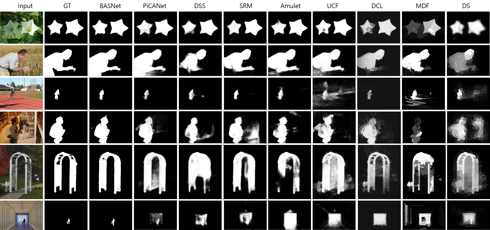
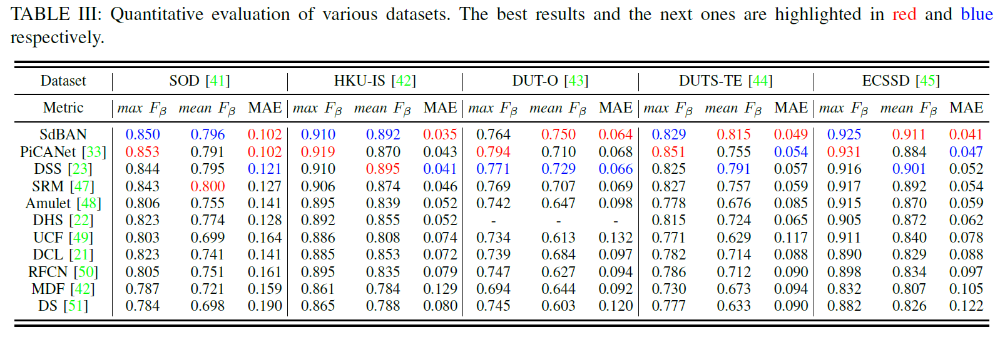
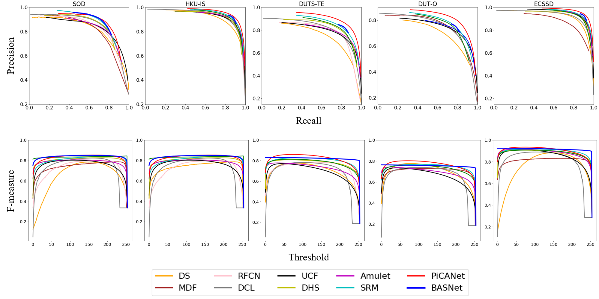

# SdBAN: Salient Object Detection Using Bilateral Attention Network with Dice Coefficient Loss

Tensorflow based keras implementation of "SdBAN: Salient Object Detection Using Bilateral Attention Network with Dice Coefficient Loss"

- Qualitative Evaluation



- Quantative Eavaluation





## Getting Started
### Installation

- Clone thos repository
```
git clone https://github.com/tiruss/Salient_Code.git
```

- You can install all the dependencies by
```
pip install -r requirements.txt
```

### Download datasets

- Download training datasets [DUTS-TR] from the link (http://saliencydetection.net/duts/download/DUTS-TR.zip)

- Download [HKU-IS] for test from the link (https://sites.google.com/site/ligb86/hkuis)

- Other datasets can download from the link (https://github.com/ArcherFMY/sal_eval_toolbox) Thank you for the awesome evaluation toolbox!

### Run experiments from pretrained weight

- Download pretrained weight from the link 

- [[Google drive]](https://drive.google.com/drive/folders/1uaMF84-0zohQ2rHi9mF3xWX4D4FgmN0Y?usp=sharing) [[Baidu drive]]()

- Run test.py
```
python test.py --weight [pretrained weight] --input_dir [test_img_dir] --output_folder "outputs"
```
- Pre-computed salinecy maps can download from the link

- [[Google drive]]() [[Baidu drive]]()

### Train from scratch

- DUTS-TR is our traning set for pair comparison

- Run train.py

```
python train.py --img_folder [DUTS-TR img dir] --label_folder [DUTS-TR label dir] --epoch --batch_size --num_gpu
